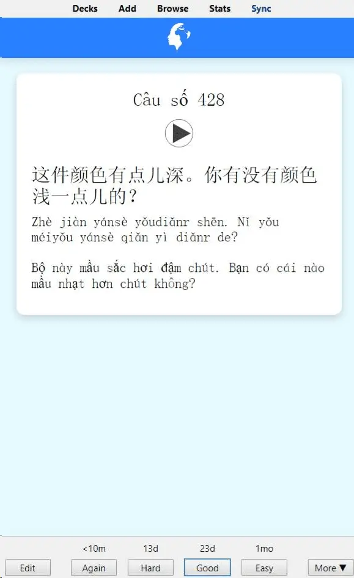

<!--truncate-->

## Nguồn: [Phạm Văn Lượng](https://www.facebook.com/groups/ankivocabulary/posts/1034190184007305/)

## Nội dung

**3000 mẫu câu giao tiếp tiếng Trung** là tài liệu thiết thực dành cho người học tiếng Trung ở mọi trình độ, đặc biệt hữu ích nếu bạn muốn cải thiện khả năng **giao tiếp tiếng Trung thực tế**.

Bộ tài liệu bao gồm:

- **3000 mẫu câu tiếng Trung thông dụng** trong đời sống hàng ngày, công việc và học tập.
- Hỗ trợ **2 phương pháp học hiệu quả**:
  - **Dịch xuôi**: từ tiếng Việt sang tiếng Trung.
  - **Dịch ngược**: từ tiếng Trung sang tiếng Việt.
- Phù hợp để luyện **phản xạ nhanh, ghi nhớ mẫu câu và từ vựng giao tiếp**.

Với cấu trúc rõ ràng và nội dung thực tiễn, đây là một trong những **deck Anki tiếng Trung giao tiếp** được đánh giá cao trong cộng đồng học tiếng Trung.

## 🔗 Tải xuống

 <a href="https://drive.google.com/file/d/1EoVlpSPUE90V-N_Q81ubAXYRcDu0scFv/view?usp=sharing"> <button class="buttonPrimary" type="button">Google Drive (ankivn)</button> </a> 

