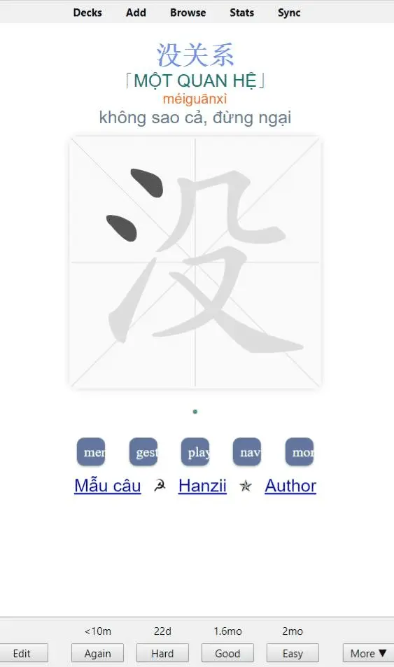

<!--truncate-->

## Nguồn: [Phạm Văn Lượng](https://www.facebook.com/groups/ankivocabulary/posts/1034190184007305/)

## Nội dung

### 📖 Bộ từ vựng HSK 9 cấp – 11000 từ đầy đủ nhất  

**Bộ từ vựng HSK 9 cấp** là tài nguyên học tập không thể bỏ qua dành cho người học tiếng Trung, đặc biệt là những ai đang chuẩn bị cho kỳ thi **HSK 2021 (phiên bản 9 cấp mới nhất)**. Bộ từ vựng này bao gồm **hơn 11.000 từ vựng**, được sắp xếp theo cấp độ từ dễ đến khó, giúp bạn **nâng cao vốn từ vựng** một cách có hệ thống.

### 📌 Đặc điểm nổi bật của bộ từ vựng HSK 9 cấp:  

✅ **Đầy đủ hơn 11.000 từ vựng** theo chuẩn HSK 9 cấp mới nhất.  
✅ **Hỗ trợ dịch nghĩa tiếng Việt + âm Hán Việt**, giúp ghi nhớ nhanh hơn.  
✅ **Luyện viết chữ Hán** với hướng dẫn từng nét.  
✅ Tích hợp vào **Anki**, giúp bạn học hiệu quả với phương pháp **lặp lại ngắt quãng (Spaced Repetition System - SRS)**.  

### 📚 Lợi ích khi học bộ từ vựng HSK 9 cấp với Anki:  

- **Cải thiện khả năng nhớ từ** nhờ phương pháp SRS.  
- **Nâng cao kỹ năng đọc – viết** với bài tập luyện viết từng chữ Hán.  
- **Tiết kiệm thời gian ôn tập** bằng cách tập trung vào các từ cần cải thiện nhất.  
- **Phù hợp cho mọi trình độ**, từ HSK 1 đến HSK 9.  

---

## 🔗 Tải xuống  

 <a href="https://drive.google.com/file/d/1j_lOwYb26Vjic_9cmscZosZ-wXXaLNjf/view?usp=sharing"> <button class="buttonPrimary" type="button">Google Drive (ankivn)</button> </a> 
