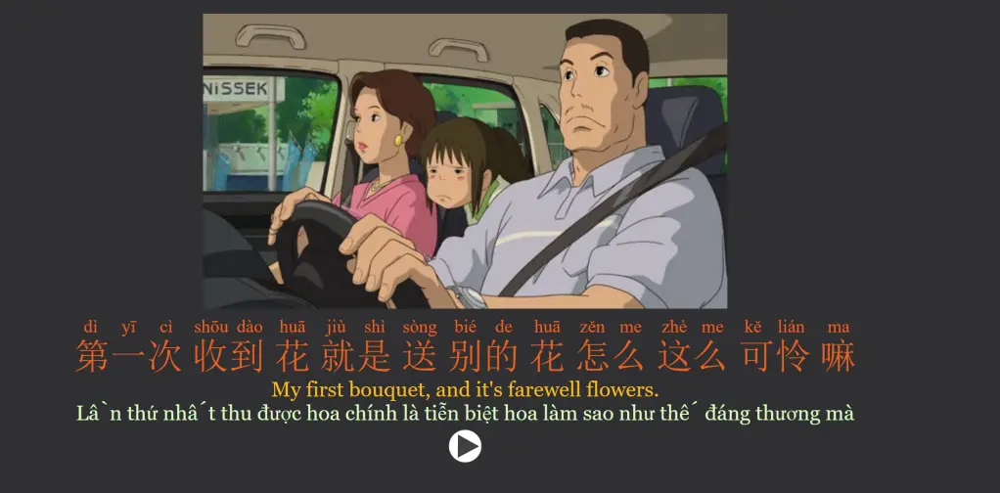
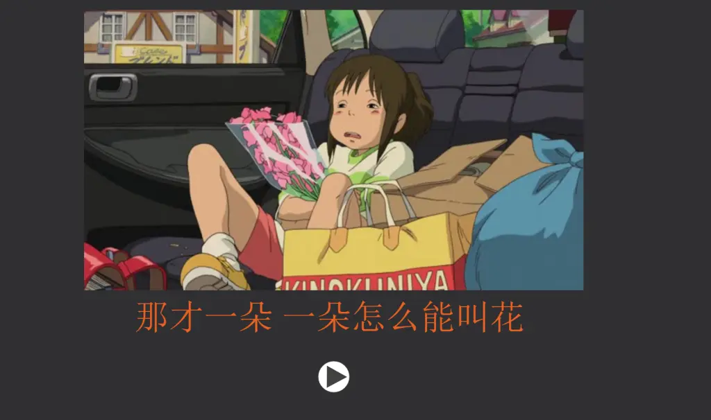
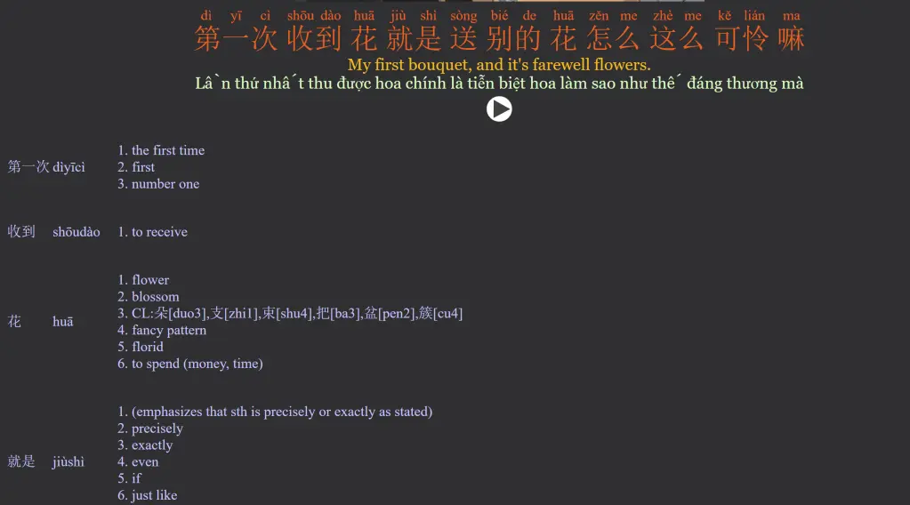
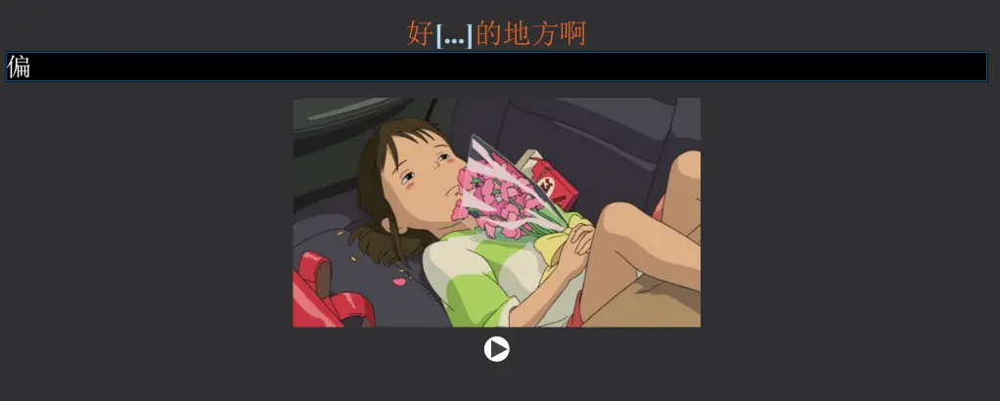
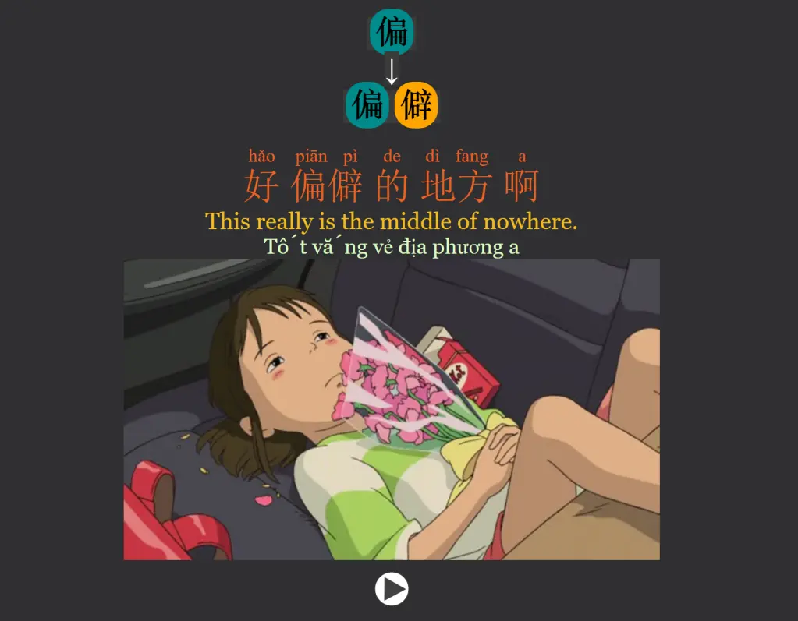
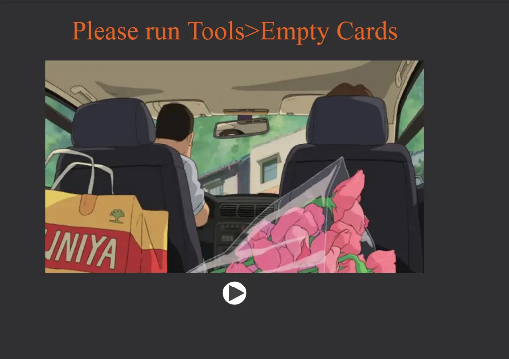
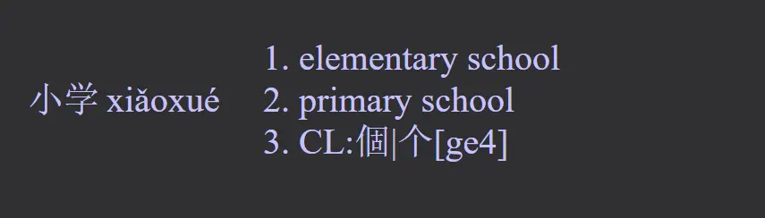
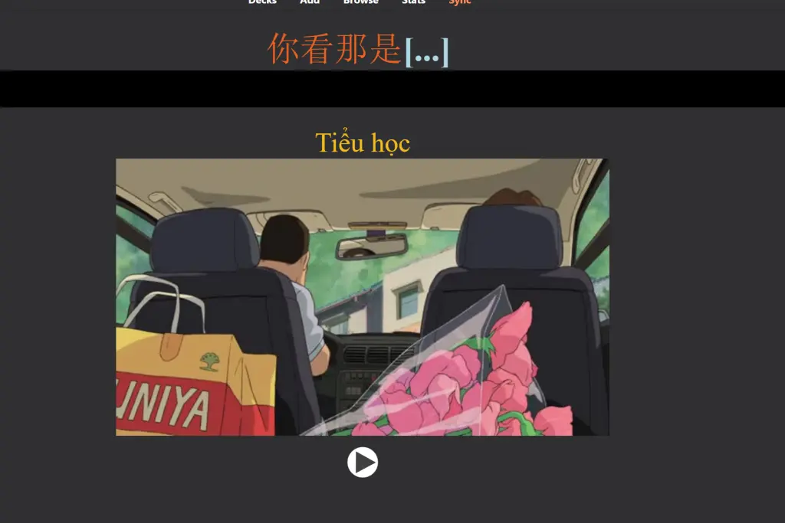

<!--truncate-->

## Nguồn: 

- [https://socialge.wordpress.com/](https://socialge.wordpress.com/2023/04/11/coming-soon-anki-spirited-away-trung-viet/)
- [Marsh Nguyễn](https://www.facebook.com/groups/ankivocabulary/posts/1390811138345206/)

## Nội dung

🌸 **Anki Spirited Away Song Ngữ Trung – Việt**

Đây là Deck đầu tiên mình muốn share cho mấy bạn có nhu cầu học tiếng Trung. Sắp tới mình sẽ tạo nhiều Deck tiếng Trung hơn vì ngôn ngữ này mình đang học chủ yếu.

⚠️ **Lưu ý:** Deck này dịch tiếng Việt khá thô, chủ yếu để bám sát nghĩa gốc và học từ vựng. Mọi dịch nghĩa đều được xử lý bằng QuickTranslator.

📌 Deck gốc được lấy từ: [https://ankiweb.net/shared/info/554870338](https://ankiweb.net/shared/info/554870338)

🧠 Cách học tương tự như các deck Nhật – Việt dạng Anime, gồm 2 phần chính:

---

## II. Cách học

Deck bao gồm:

- **📘 Reading Deck** – Luyện nghe và đọc  
- **✍️ Cloze Deck** – Luyện ghi nhớ từ vựng và ngữ pháp

---

### 1. Reading Deck

- Mặt trước: hình ảnh + câu thoại + audio  

- Mặt sau: dịch nghĩa + từ điển phân tích  

📌 Từ điển phân tích bị ẩn, bạn cần **rê chuột xuống** để xem chi tiết  

---

### 2. Cloze Deck

Deck chính để luyện nhớ sâu từ vựng:

- Mặt trước: điền vào chỗ trống từ phù hợp  

- Mặt sau: hiển thị đáp án + phân tích ngữ pháp và nghĩa  
  

---

### 🛠️ Hướng dẫn thêm Cloze và định nghĩa:

- Các thẻ đầu đã có cloze sẵn  
- Các thẻ sau bạn cần tự thêm:  

👉 Rê chuột xuống, xác định từ cần học  
👉 Vào Edit → Tô đen từ → Click `[...] Cloze deletion` → Save  
👉 Có thể paste định nghĩa vào field để mặt trước hiện đầy đủ hơn  

Kết quả là bạn có một thẻ vừa luyện nghĩa, vừa luyện từ hiệu quả hơn:

---

## III. 📥 Download

Deck hiện có khoảng **1751 card**, sẽ tăng dần nếu bạn tạo thêm Cloze.

 <a href="https://www.mediafire.com/file/1957sgh24zpl7xj/Spirited+Away+Chinese.apkg/file"> <button class="buttonPrimary" type="button">Mediafire (tác giả)</button> </a> 

 <a href="https://drive.google.com/file/d/185S-HNQRpRdAkw_HXn8vKk5KdVWsc8Kr/view?usp=sharing"> <button class="buttonPrimary" type="button">Google Drive (ankivn)</button> </a> 
