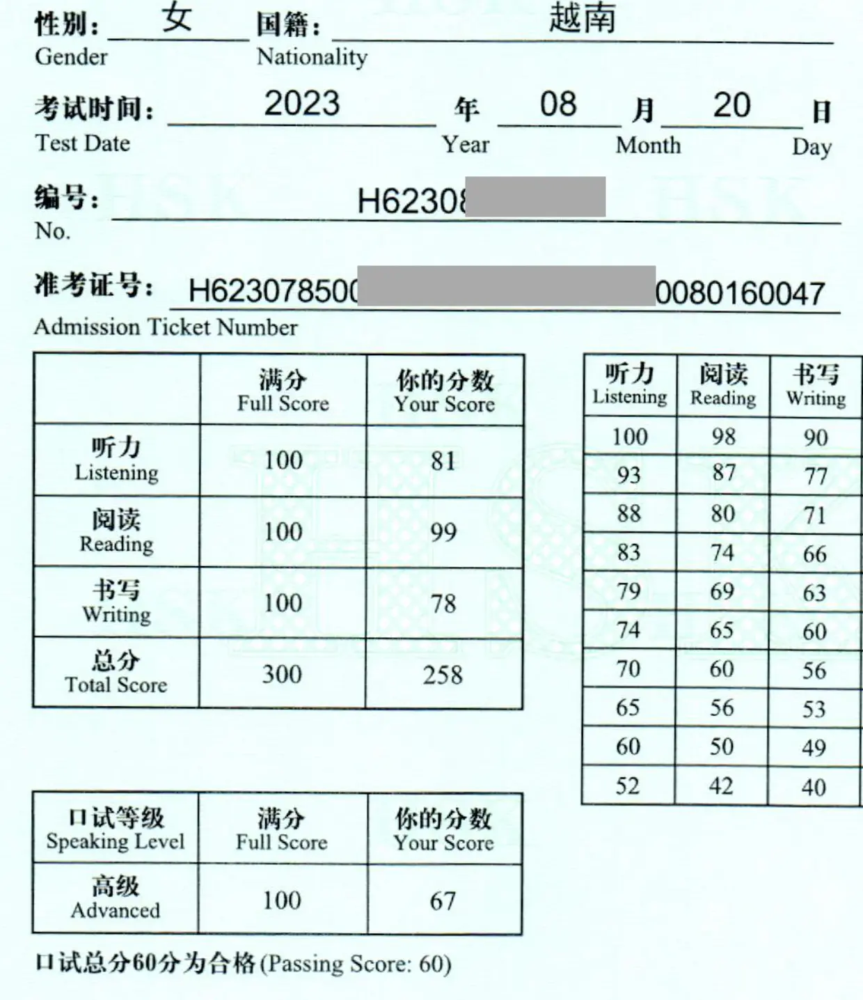
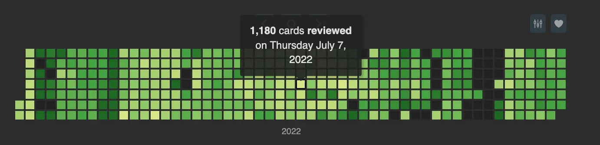

<!--truncate-->

---

## 🧾 Nguồn: [Bảo Trân](https://www.facebook.com/share/1EwwtBRK1H/)

---

## Preview

---

## 🧠 Lưu ý khi sử dụng bộ thẻ HSK1–9

🔰 **Dành cho người mới bắt đầu:**

- **Ưu tiên tải phiên bản mới nhất** nếu bạn lần đầu dùng.
- **Không bắt buộc cập nhật** nếu đã học bản cũ, trừ khi có thay đổi lớn.

📥 **Cách tải và cập nhật:**

- **Học tới đâu tải tới đó** – thẻ được cập nhật thường xuyên theo tiến độ học cá nhân.
- Tên file `.apkg` có định dạng `YYMMDD` để bạn tiện theo dõi phiên bản mới nhất.

📚 **Bộ thẻ bao gồm:**

- ✅ **12 bộ từ vựng HSK1–9**: mặt trước là từ tiếng Trung, mặt sau là nghĩa tiếng Việt + ví dụ + từ đồng nghĩa nếu có.
- ✅ **3 bộ Hán tự** (Sơ – Trung – Cao cấp): mặt trước là gợi ý tiếng Việt + audio; mặt sau là nét viết + bộ thủ liên quan.

🛠️ **Chỉnh sửa gần đây:**

- Cập nhật audio, chia nghĩa theo cấp độ, thêm từ đồng nghĩa tiếng Anh, sửa ví dụ.
- Một số thay đổi lớn sẽ được ghi chú riêng.

🎨 **Thiết kế thẻ:**

- Giao diện đơn giản, dễ nhìn, tập trung vào nội dung.
- Bạn có thể tự chỉnh CSS để phù hợp gu thẩm mỹ cá nhân.

💡 **Gợi ý:**

> Dù AI dịch thuật ngày càng giỏi, nhưng **học ngôn ngữ vẫn là hành trình quan trọng**. Cứ học đều – sẽ tới lúc thấy vui!

---

## 🧪 Quá trình học và thi HSK6

🧭 Đây là **hành trình học và thi thật** của mình với HSK6. Hy vọng những chia sẻ dưới đây sẽ giúp bạn hình dung rõ hơn về quá trình ôn thi và sử dụng Anki hiệu quả.

### 1. Học

Mình bắt đầu học tiếng Trung vào năm 2019. Có đăng ký 1 khoá ở trung tâm, nhưng chỉ học vài buổi rồi bỏ, vì mình thích tự học hơn.

**Học từ vựng:** Mình vừa học từ mới vừa tạo bộ thẻ Anki. Việc tự tạo cũng giúp mình nhớ lâu hơn. Ví dụ, 1 số giải nghĩa trong từ điển Trung - Việt online mà mình cảm thấy lấn cấn thì mình sẽ tìm kiếm thêm giải thích bằng tiếng Trung, tiếng Anh và tiếng Việt, nên nắm vững được ý nghĩa của từ hơn.

Việc học từ mới diễn ra không liên tục từ năm 2019 đến năm 2021, kiểu 3 tháng học thì 6 tháng nghỉ hoặc ngược lại.

Đến giai đoạn 2022-2023 thì mình học từ mới đều hơn (gần như mỗi ngày), có những giai đoạn học 30 từ mới 1 ngày và số lượng thẻ ôn tập lên đến 1.000 từ 1 ngày. **Chỉ có chịu khó, kiên trì học tập mới tạo nên thành công, mình không biết một đường tắt nào cả.**

**

Đến thời điểm đi thi thì mình đã học xong 06 bộ thẻ HSK1-6 và đang vừa học vừa tạo bộ thẻ HSK7-9, nên về mặt từ vựng thì có thể khẳng định là thừa để đi thi rồi.

**Học ngữ pháp:** Bên cạnh các bộ thẻ từ vựng, mình cũng tạo thêm bộ thẻ dạng điền từ vào chỗ trống để học ngữ pháp.

Học mà chơi, chơi mà học: Mình có học tiếng Trung theo một số cách khác, gồm: làm phụ đề tiếng Việt cho **video tiếng Trung** và **dịch truyện fanfic**. Nói ngắn gọn là cống hiến trí lực trong quá trình đu idol và diễn viên Trung. Bên cạnh đó, thay vì xem youtube thì mình xem video trên Bilibili, lướt Weibo, v.v. Mình cảm thấy những việc làm này đã giúp mình luyện đọc, luyện nghe và làm quen với ngôn ngữ giao tiếp (không mang nặng tính sách vở) và thậm chí cả ngôn ngữ giới trẻ/tiếng lóng.

---

### 2. Ôn thi

**Đọc & Nghe:** Tầm 1-2 tháng trước khi thi thì mình có luyện vài đề Đọc và Nghe. Thấy kết quả cũng ok.

**Nói và Viết:** Do tâm lý thi cử cũng khá yolo nên tầm nửa tháng trước khi thì mình bắt đầu luyện Viết và Nói. Cụ thể là đọc một chút giáo trình, và làm 1, 2 đề ôn tập.

Nói chung là mình không ôn tập quá nhiều, việc thi cử có sự đồng hành của ông bà tổ tiên.

----

### 3. Thi cử

Mình thi HSK6 vào tháng 8/2023. Đây là lần đầu mình thi HSK, nhưng cũng không quá áp lực. Mình nghĩ tâm lý thoải mái là 1 điểm cộng lớn. Đề thi thật có thể khó hơn đề bạn luyện tập ở nhà ở một hoặc một số kỹ năng nào đó. Việc bạn cần làm là phải tự trấn an bản thân, bình tĩnh hoàn thành cả bài thi.

Đợt mình thi thì mình thấy phần Đọc và Nghe khó hơn hẳn những đề ôn tập mình làm, trong khi đó phần Viết và Nói thì dễ hơn hẳn đề ôn tập. Nên mình khá bất ngờ khi kết quả phần Đọc và Nghe không tệ lắm, còn phần Viết và Nói thì may mắn đủ điểm nhờ đề không quá khó.

---

Mình không sử dụng mẹo thi cử, vì mình không biết mẹo nào cả. Chỉ có 1 lưu ý là phần Đọc thì phần 1 (phần tìm câu có lỗi biểu đạt) mình làm cuối cùng, vì phần này khó.

Mình cảm thấy việc trang bị một khối lượng từ mới đầy đủ, làm quen với các cấu trúc ngữ pháp tiếng Trung đã giúp mình không gặp quá nhiều khó khăn trong việc nghe hiểu và đọc hiểu đề.

Một điểm nữa là mình học chuyên ngoại ngữ ở trường cấp 3 (việc thi cử ngoại ngữ thì đã bắt đầu tư cấp 2), nên mình cảm thấy qua thời gian, mình đã có nuôi dưỡng cái gọi là cảm nhận về ngôn ngữ (?!), đại loại là mình thấy đáp án này có vẻ đúng, nghe hay hay, còn vì sao đúng thì mình không biết, có thể là đã gặp ở đâu đó rồi mà mình không nhớ. Hiện tại mình đi thi dựa vào cảm nhận và tổ tiên mách bảo là chính.

P/s: Vì mục tiêu trở thành polyglot.
*(polyglot: người lĩnh hội thành thạo bốn ngôn ngữ trở lên (tính cả tiếng mẹ đẻ)*

**P/s 2:** Trong quá trình ôn thi HSK6, mình có tổng hợp các tài liệu ôn tập 4 kỹ năng và tài liệu luyện đề. Nếu bạn nào cần thì cứ comment nhé, mình sẽ chia sẻ. Cũng toàn là tài liệu tổng hợp trên mạng cả thôi, không phải bí mật gì.**

---

## Tài liệu quan trọng

### Mở sang tab mới để đọc

[👆 Bấm vào đây để đọc](https://docs.google.com/document/d/1RdL8wWu6hjj2Gei39RI3__xozTOv1r-GdfqbnniiUPs/edit?usp=sharing)

### File nhúng (đọc trên ankivn)

<iframe
  src="https://docs.google.com/document/d/e/2PACX-1vQbsFxkOFNFZPEeaZmWlu9S6eAzyKCmjyHOusdnWI0uNCV0EwfsEmXeOwKoEKdCTk4nVUMjLmmXSjAJ/pub?embedded=true"
  width="100%"
  height="700px"
  style={{ border: "none" }}
></iframe>

---

## 🔗 Tải xuống

 <a href="https://drive.google.com/drive/folders/1dfir8Ux8a6qxsOZ5gH1VGYUiuATHzBi2"> <button class="buttonPrimary" type="button">Google Drive (tác giả)</button> </a> 

 <a href="https://drive.google.com/drive/folders/1t7cwv9PVHBtwQqaqr_GsNZLRYFifoeQD?usp=sharing"> <button class="buttonPrimary" type="button">Google Drive (ankivn) - 21/03/2025</button> </a> 
