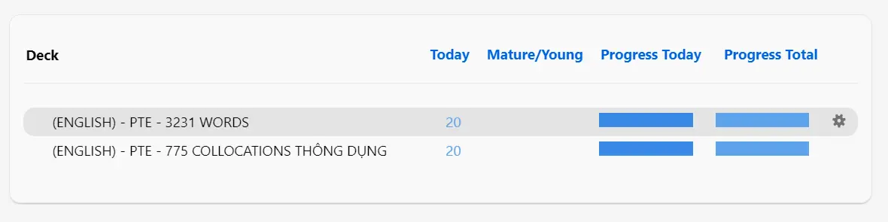
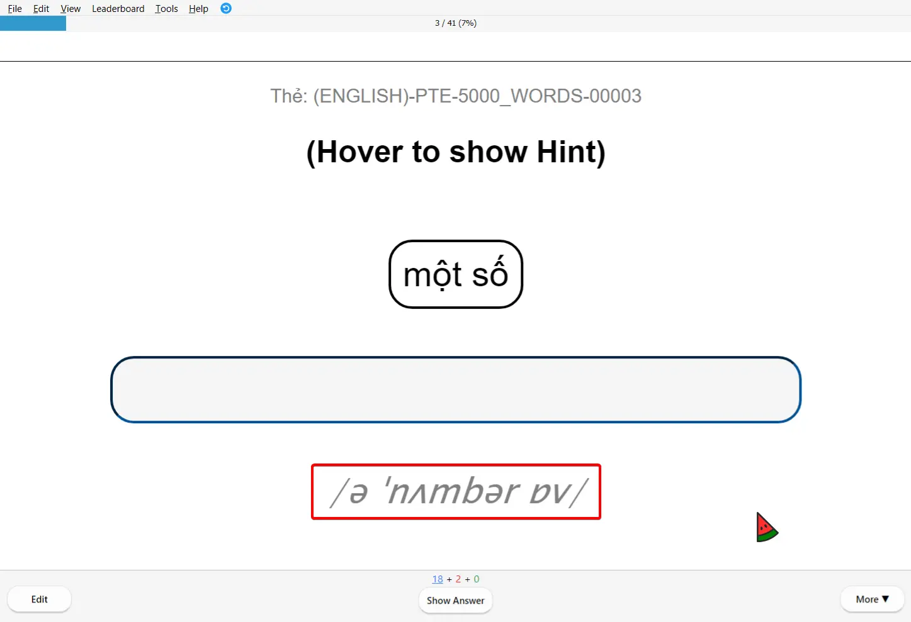
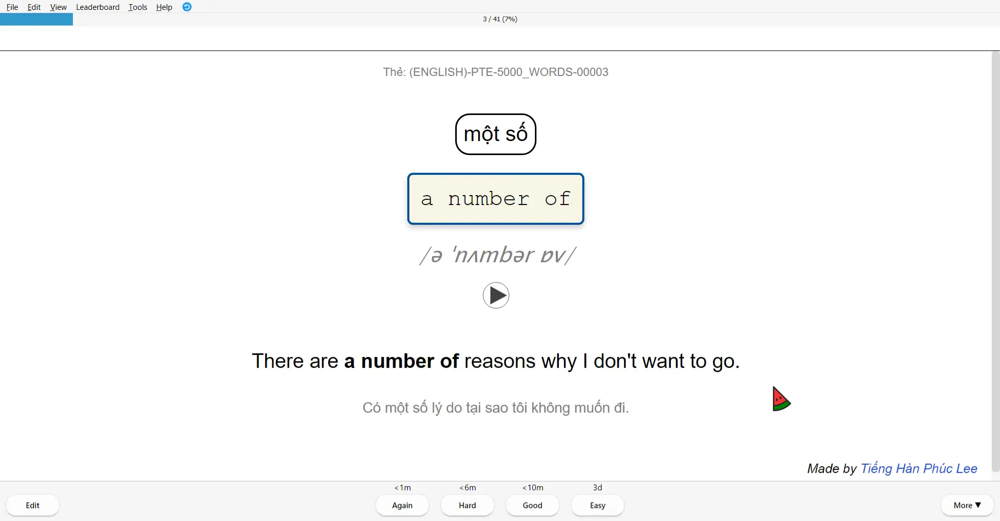
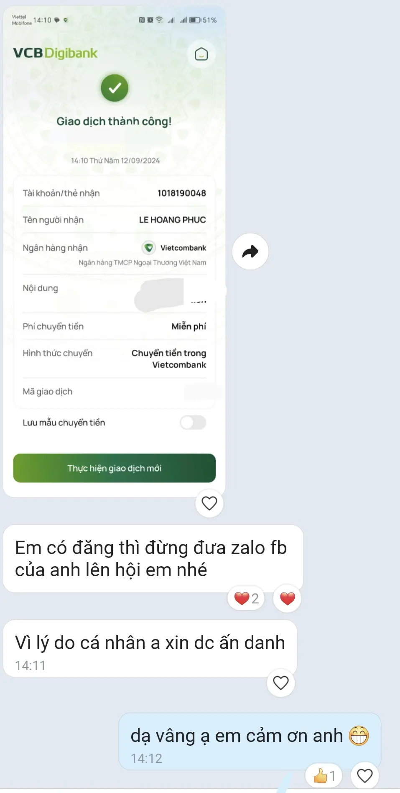
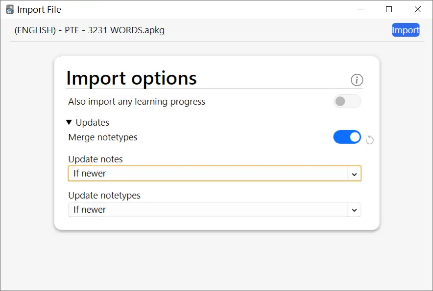
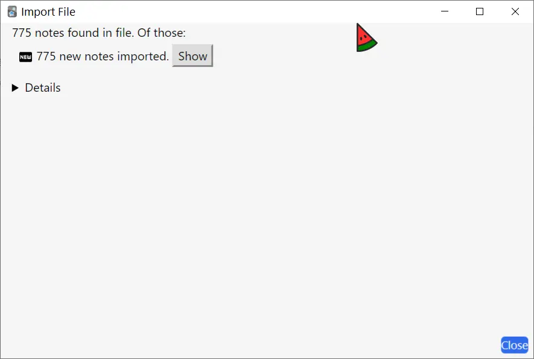

<!--truncate-->

## Nguồn: [Tiếng Hàn Phúc Lee](https://www.facebook.com/tui.la.phuc747/) & người thuê ẩn danh

## Nội dung

### **📌 Bộ thẻ bao gồm:**  

✔ **3,231 từ vựng** – Tổng hợp từ vựng quan trọng, hữu ích cho mọi cấp độ.  
✔ **775 Collocations thông dụng** – Giúp bạn học từ vựng theo cụm từ tự nhiên, tăng khả năng sử dụng thực tế.  

import YouTubeEmbed from '@site/src/components/YouTubeEmbed';

<YouTubeEmbed videoId="Y8wAA358C-s" />

### **📸 Hình ảnh bộ thẻ**

## Lưu ý khi thêm thẻ

## Tải xuống

💡 **Bản 1 trong video trên là bản tải xuống chính thức.**  
🎧 **Bản 2 có âm thanh phát ở mặt trước** – Phù hợp cho những ai muốn học dễ dàng hơn bằng cách nghe trước rồi nhập đáp án. 

### 3,231 từ vựng PTE

 
  <a href="https://drive.google.com/file/d/11kcXbHcVzaABRrn6f_K5fFaqEn1nUFDC/view?usp=sharing"> 
    <button class="buttonPrimary" type="button">Google Drive (bản DOWNLOAD)</button> 
  </a> 

 <a href="https://drive.google.com/file/d/11kMGywWeP6Wljep4bLNfCYbI8EUT5ekx/view?usp=sharing"> <button class="buttonPrimary" type="button">Google Drive (bản 2)</button> </a> 

### 775 Collocations thông dụng

 
  <a href="https://drive.google.com/file/d/11mNwT-CfgxyyN6eq5VXQ9_sVNneTM5wP/view?usp=sharing"> 
    <button class="buttonPrimary" type="button">Google Drive (bản DOWNLOAD)</button> 
  </a> 

 <a href="https://drive.google.com/file/d/11lo5znwa4XiYTmEfdRK01O4klDHxulWW/view?usp=sharing"> <button class="buttonPrimary" type="button">Google Drive (bản 2)</button> </a> 
