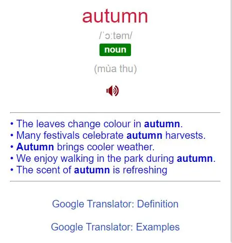
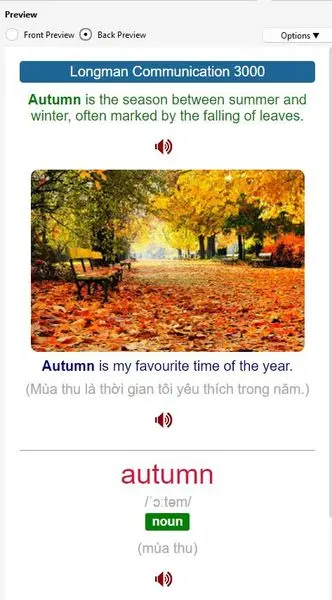
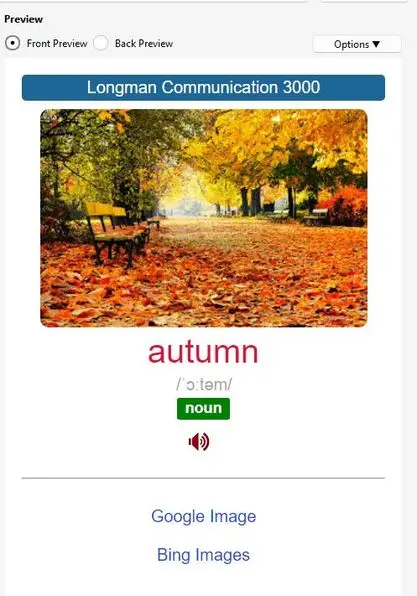

<!--truncate-->

## Nguồn: [Triệu Minh](https://www.facebook.com/groups/ankivocabulary/posts/1739018540191129/)

## Nội dung

Bộ thẻ **Longman Communication 3000** gồm **3,604 notes**, giúp bạn học từ vựng hiệu quả với hệ thống phân loại thông minh.

---

  
  

---

  
  

---

### **Về hình ảnh**  

✅ **Tích hợp 2 liên kết Google Image & Bing Image**  
➡ Tìm hình ảnh phù hợp với từ vựng hoặc ví dụ chỉ bằng một cú nhấp chuột, giúp bạn cá nhân hóa bộ thẻ theo cách học của mình.  

### **Về âm thanh**  

🚫 **Chưa có audio** – Nếu bạn sở hữu **Hyper TTS xịn**, hãy thêm âm thanh và chia sẻ cùng cộng đồng Anki.  

**Gợi ý voice Hyper TTS:**  
- 🎙 **Giọng nữ (UK)**: `English(UK), Female, en-GB-News-H (Google)` (Dùng cho Word & Example)  
- 🎙 **Giọng nam (UK)**: `English(UK), Male, en-GB-Studio-B (Google)` (Dùng cho Definition)  

### 📖 **Tích hợp Goldendict – Tra cứu dễ dàng hơn**  

🔹 **Card 2 hỗ trợ Anki to Goldendict**, giúp bạn tra từ nhanh chóng mà không cần rời khỏi Anki.  

💡 **Yêu cầu:**  
- Cài **Goldendict** (phiên bản khuyến nghị: `24.09.0.3`).  
- Thêm từ điển phổ biến như:  
  - **Lạc Việt**  
  - **Longman Dictionary Of Contemporary English 6th EnEn**  

👉 **Link tải Goldendict & từ điển**: [forum.freemdict.com](https://forum.freemdict.com/latest)  

### ⚙️ **Cài đặt Anki với Goldendict**  

1️⃣ **Mở** `Edit => Preferences => Network`  
2️⃣ **Chọn** `Anki Connect`  
3️⃣ **Nhấn OK** ✅  

## Tải xuống

 <a href="https://www.mediafire.com/file/2ao0u7we3wa5fkc/Longman+Communication+3000.apkg/file?fbclid=IwZXh0bgNhZW0CMTAAAR0Q2rDq43SurjoZTs9nF0n6e_8Mf3c2Tkg7O9N2MUs2d_AFg5nUjp1CxJg_aem_Kifli-LoBGS02Fd3vSX-dQ"> <button class="buttonPrimary" type="button">Link Mediafire của tác giả</button> </a> 

 <a href="https://drive.google.com/file/d/11gDIDWCysoSa92S0fnjIqY3-mU7argvf/view?usp=sharing"> <button class="buttonPrimary" type="button">Google Drive (ankivn)</button> </a> 

